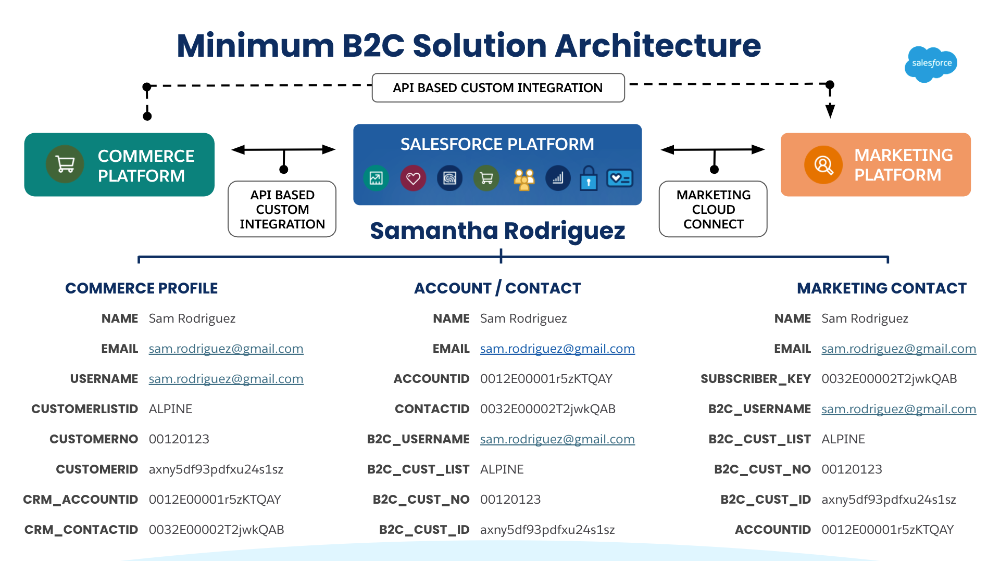
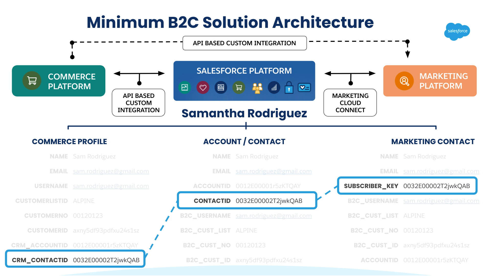
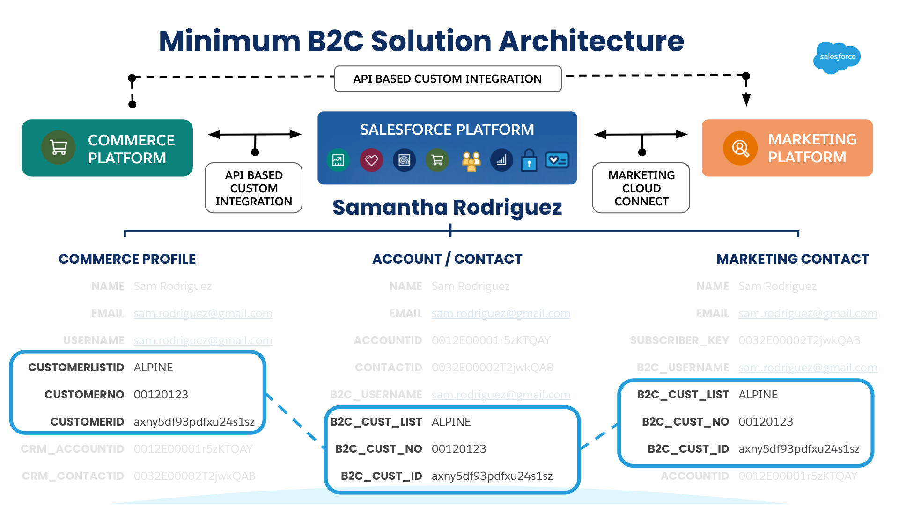
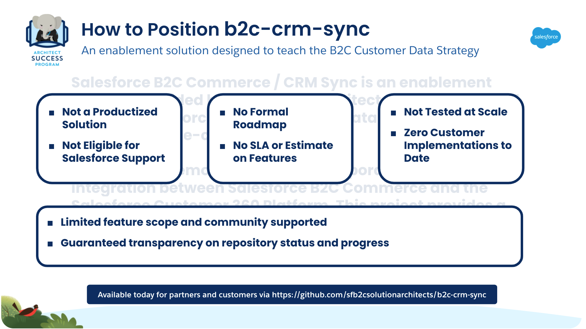
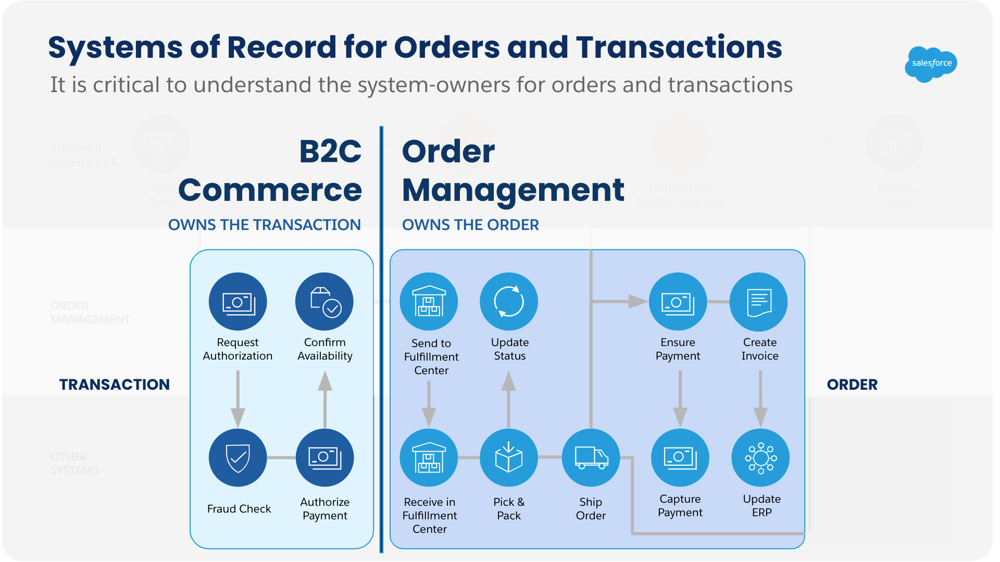

> **Check Back for Updates**   We're actively updating and maturing our documentation site, so please check back for updates.  We recommend [watching our repo](https://sfb2csa.link/b2c-crm-sync) to stay in the loop as this enablement solution continues to mature.  In the meantime, please pardon our dust -- and let's get to the questions. :)

**Q.&nbsp;&nbsp;What exactly is b2c-crm-sync?** 
**A.**&nbsp;&nbsp;[b2c-crm-sync](https://sfb2csa.link/b2c-crm-sync) is a contemporary perspective on how to integrate [Salesforce B2C Commerce Enterprise](https://www.salesforce.com/products/commerce-cloud/ecommerce/) and the [Salesforce Customer 360 Platform](https://www.salesforce.com/products/platform/overview/) (ex. [Service Cloud](https://www.salesforce.com/products/service-cloud/overview/)) to enable frictionless customer experiences.  It operationalizes the B2C Commerce Customer Data Strategy taught by the B2C Solution Architect Program, and facilitates the progressive resolution and synchronization of B2C Commerce Customer Profiles with Salesforce Platform Accounts and Contacts or PersonAccounts. 

	

This creates a common identifier (the Salesforce Platform ContactID) that can be used to consistently represent a B2C Commerce Customer Profile in the Salesforce Platform, Marketing Cloud, and other systems.  It also enables the synchronization of key B2C Commerce customer identifiers across these Salesforce Products -- which unlocks REST API access to any of these systems from any source system.

	
	
	

You can use this customer data strategy to implement multi-cloud use-cases that leverage the best-of-breed capabilities of the Salesforce Product Portfolio.

**Q.&nbsp;&nbsp;What do you mean by 'a contemporary perspective on integrating B2C Commerce and the Salesforce Platform'?** 
**A.**&nbsp;&nbsp;Yeah, this definitely needs a little explanation.  One of our goals with this enablement solution is to demonstrate how accessible and achievable it is to integrate B2C Commerce and the Salesforce Platform using declarative tools.  So what does that mean?

- We primarily use [Salesforce Flow](https://trailhead.salesforce.com/en/content/learn/trails/automate_business_processes) for almost all business logic, REST APIs, and data processing. More precisely, we use Flow first -- and have a library of over [forty self-documented flows](https://github.com/sfb2csolutionarchitects/b2c-crm-sync/tree/master/src/sfdc/force-app/main/default/flows) that can be customized.
- We use [Duplicate and Match Rules](https://trailhead.salesforce.com/en/content/learn/modules/sales_admin_duplicate_management) to manage the identification rules used to implement the B2C Customer Data Strategy.
- We do use Apex, but this is largely in the form of [Apex Invocable Actions](https://trailhead.salesforce.com/en/content/learn/projects/quick-start-explore-the-automation-comps-sample-app).  This is custom Apex code, but Apex code that can specifically be re-used in Flows.

So, instead of writing the solution in 100% custom Apex (which wouldn't be very contemporary) -- we specifically took the approach of using the declarative tools Salesforce provides to highlight just how available, accessible, and maintainable this multi-cloud integration approach is.  We also place a premium on test automation, and include tests for our Apex code, our B2C Commerce code, our CLI code, and supported use-cases.

By taking this approach we believe that delivery teams should be able to go faster, innovate more, spend less time manual testing, and implement maintainable solutions.  These are the expectations for contemporary platforms, software, and delivery teams.

**Q.&nbsp;&nbsp;What do you mean by multi-cloud use-cases?  Can you provide examples?** 
**A.**&nbsp;&nbsp;Absolutely.  A few examples of multi-cloud use-cases include:
- Simplifying the effort for Service Agents to find the most accurate record representing a B2C Commerce Customer in Service Cloud
- Creating a case on behalf of a B2C Commerce Customer
- Scheduling appointments in Service Cloud using Lightning Scheduler for B2C Commerce Customers
- Placing a B2C Commerce Customer on a Marketing Cloud Journey like Abandoned Cart, Coupon Redemption, or Back in Stock Notifications
 

If you are a Partner, you can enroll in our [B2C Solution Architect Curriculum](https://sfb2csa.link/curriculum/plc) via **Partner Learning Camp** -- and learn how to implement these use-cases using our [library of 26 courses](https://sfb2csa.link/curriculum/plc) on multi-cloud use-cases.  Salesforce Employees can also access this curriculum via [Astro's Course Tracker](https://sfb2csa.link/curriculum/act).

If you are a customer, the [Salesforce Customer 360 Guides](https://sfb2csa.link/guides) include a collection of [Solution Kits for Retail](https://sfb2csa.link/solution-kits) that provide guidance on how to implement the most common versions of these use-cases.  You can use [b2c-crm-sync](https://sfb2csa.link/b2c-crm-sync) to provide the customer data strategy that all of these use-cases require where B2C Commerce is mentioned as a required product.

**Q.&nbsp;&nbsp;Is b2c-crm-sync a Salesforce Product?** 
**A.**&nbsp;&nbsp;No, it's not.  And this is important to understand.  [b2c-crm-sync](https://sfb2csa.link/b2c-crm-sync) is an **enablement solution** developed by Architect Success in partnership with Architects from Salesforce's ICX, SCPPE, Services teams, and Salesforce Partners.  Its purpose is to teach best-practices on how to integrate B2C Commerce and the Salesforce Platform leveraging the declarative tools available today.

**Q.&nbsp;&nbsp;Ok -- what exactly is an 'enablement solution' and how is that different from being a Salesforce Product?** 
**A.**&nbsp;&nbsp;Since this solution is not Productized by Salesforce, there are a number of important expectations that customers and partners should have:

- Customers and partners leverage this solution at-will, and with no expectation of Technical Support or Warranty provided by Salesforce.  This is explained by the [BSD 3-Clause License](https://github.com/sfb2csolutionarchitects/b2c-crm-sync/blob/master/License.md) we leverage for [b2c-crm-sync](https://sfb2csa.link/b2c-crm-sync).
- There is no formal roadmap or release schedule for [b2c-crm-sync](https://sfb2csa.link/b2c-crm-sync).  The closest thing to this we have is our [issues log](https://github.com/sfb2csolutionarchitects/b2c-crm-sync/issues) -- which we curate and address regularly.  That said, our issue resolution schedule does not have a set cadence like Salesforce's release schedule.
- [b2c-crm-sync](https://sfb2csa.link/b2c-crm-sync) has not been tested at scale via dedicated load or performance testing.  Our solution is a point-to-point near real-time integration that synchronizes B2C Commerce Customer Profiles with Salesforce Platform Accounts / Contacts or PersonAccounts.  Depending on your current eCommerce or Salesforce Platform traffic -- this approach may not work for you.
- Being new to the Salesforce ecosystem, we have zero customer implementations at this time.  While we expect this to change soon, we think it is important to be clear about this with customers and partners.

	

Our commitment to you as caretakers of this enablement solution is to always been transparent about status, known issues, and test coverage.  We are committed to limiting to scope of this project so that it does one thing well -- specifically, the implementation of the data strategy necessary to support multi-cloud customer experiences.

**Q.&nbsp;&nbsp;Can I use b2c-crm-sync in a production environment?** 
**A.**&nbsp;&nbsp;Yes, you can -- and we want you to, because we believe this solution provides the customer data strategy necessary to deliver integrated customer experiences across Salesforce Products.  That said, it is the responsibility of customers and partners to extend and customize this enablement solution to meet their needs.

We provide the integration approach, business logic patterns, and development assets to accelerate this process.  We also provide testing tools that can be used and extended to validate solution behavior.  This foundation is specifically designed to be built upon and customized to meet the varying needs of Salesforce customers.  It is not, however, designed to solve or address every customer use-case or enteprise architecture scenario.

**Q.&nbsp;&nbsp;Does b2c-crm-sync support order synchronization between B2C Commerce and Service Cloud?** 
**A.**&nbsp;&nbsp;No -- it doesn't.  We have no plans on implementing this use-case, as productized solutions for this exist within the Salesforce Product Portfolio (see [Salesforce Order Management](https://sfb2csa.link/products/som) for details).

	

Please note that it is not considered a best-practice to synchronize orders from B2C Commerce with a non-order management system like Service Cloud.  B2C Commerce is not considered the system of record for orders; order management systems play this role.  At best, B2C Commerce should be considered the system of transaction for orders.

If you have a need to expose order details in Service Cloud, that should be handled by integrating with your order management system -- and ideally retrieving order details through federation.  If you are seeking a productized Salesforce Solution for this requirement, please consider [Salesforce Order Management](https://help.salesforce.com/articleView?id=sf.om_order_management.htm&type=5).

**Q.&nbsp;&nbsp;Does b2c-crm-sync support case creation from B2C Commerce?** 
**A.**&nbsp;&nbsp;No -- it doesn't.  We have no plans on implementing this use-case, but this is a great example of the type of use-case that you could implement leveraging [b2c-crm-sync](https://sfb2csa.link/b2c-crm-sync) to resolve and create the Contact or Person Account representing the B2C Commerce Customer submitting the case.

The value that [b2c-crm-sync](https://sfb2csa.link/b2c-crm-sync) for this use-case is the creation of the Contact or Person Account following the B2C Customer Data Strategy.  This ensures that the Contact -- whether it represents an unauthenticated customer or a registered B2C Commerce Customer Profile -- can be identified and resolved with consistency as part of other use-cases.

**Q.&nbsp;&nbsp;How long does it take to setup and install b2c-crm-sync?** 
**A.**&nbsp;&nbsp;**15 minutes** -- and no, we're not kidding.  We've developed a deployment model for B2C Commerce and Salesforce scratchOrgs leveraging modular CLI tooling to make this as straight forward as possible.

There are configuration pre-requisites that need to be addressed before deployment.  That said, we have a consistent and trustworthy deployment process outlined in our [ReadMe.md](https://sfb2csa.link/b2c-crm-sync). That said, you can deploy this to a Salesforce B2C Commerce sandbox and Development scratchOrg and run all unit-tests to validate the **installation in 15 minutes or less**.

**Q.&nbsp;&nbsp;I've got a project that is going live with the Salesforce B2C Commerce to Service Cloud Connector?  Should I use b2c-crm-sync instead?** 
**A.**&nbsp;&nbsp;This is a difficult question to answer without more details about the use-cases being implemented and the overall implementation goals.  That said, we ask you to consider the following:

- Decisions like this should always be driven by business value vs. investment.  If you've already implemented the connector, then you should probably stick with it.  What can influence this decision are future roadmap plans for your organization weighed against the limitations of the legacy connector.
- The legacy B2C Commerce to Service Cloud Connector carries a significant amount of technical debt and has limitations (like only single-site support and no support for Accounts and Contacts).  If these requirements are important to you, then you should evaluate if b2c-crm-sync will work for you and your timeline (it supports both).

Candidly, it may be more expensive to customize the legacy connector than implement [b2c-crm-sync](https://sfb2csa.link/b2c-crm-sync).  We cannot make that determination for you, but we do ask you to consider that if you are curious.  Always remember to drive decisions like this by comparing ROI against investment -- and the technical debt that is created from either choice.

**Q.&nbsp;&nbsp;Can b2c-crm-sync be extended to support other use-cases besides customer profile synchronization?** 
**A.**&nbsp;&nbsp;Yes -- it absolutely can; that's the whole point of this enablement solution.  We provide the integration framework and operationalize the data strategy necessary to consistently identify B2C Commerce Customers across the Salesforce Platform.  This foundation can be extended to support other use-cases leveraging our framework and the declarative tools available today via the Platform.

A great example of this is [Assisted Shopping](https://sfb2csa.link/courses/assisted-shopping).  We've included this use-case (also known as [Order on Behalf Of](https://sfb2csa.link/kits/oobo) with the initial release to showcase how easy it is to extend this solution.  What previously was implemented in Apex via the legacy Service Cloud Connector has now been implemented in Flow supporting multiple B2C Commerce storefronts.

**Q.&nbsp;&nbsp;Does b2c-crm-sync support B2C Customer Profile Address Book synchronization with the Salesforce Platform?** 
**A.**&nbsp;&nbsp;No, we do not.  We thought about it, but could not identify a business-value generating use-case to justify the effort.  That said, we are re-considering it as a vehicle to teach how to leverage [Salesforce Connect Custom Adapters](https://developer.salesforce.com/docs/atlas.en-us.apexcode.meta/apexcode/apex_connector_custom_adapter.htm).

**Q.&nbsp;&nbsp;Is there a way for me to contribute to b2c-crm-sync?** 
**A.**&nbsp;&nbsp;Yes!  We're always seeking contributors and collaborators to raise our test-coverage, simplify our deployment automation, or extend the solution to demonstrate new patterns for integrating B2C Commerce Enterprise with the Salesforce Platform.  If you'd like to contribute to the enablement solution, you should:

- First, [fork our repository](https://sfb2csa.link/b2c-crm-sync).  This will give you a personal copy that is "connected" to the main project.
- Second, review our [contribution guidelines](https://github.com/sfb2csolutionarchitects/b2c-crm-sync/blob/master/Contributing.md) and [code of conduct](https://github.com/sfb2csolutionarchitects/b2c-crm-sync/blob/master/CODE_OF_CONDUCT.md).  These documents describe how we'd like to collaborate with our community and the expectations we should have of each other.
- Third, check out our [issues-list](https://github.com/sfb2csolutionarchitects/b2c-crm-sync/issues) and see if there's an issue you'd like to address.  You can also [submit an issue](https://github.com/sfb2csolutionarchitects/b2c-crm-sync/issues/new) representing a bug you've found or an enhancement you're keen on.

If you've found an issue (hopefully it's [hoody-worthy](https://github.com/sfb2csolutionarchitects/b2c-crm-sync/issues?q=is%3Aopen+is%3Aissue+label%3Ahoody-worthy) -- then go ahead and get started making it real.  We look for clean, readable code, documentation updates, and unit tests in all our [pull-requests](https://github.com/sfb2csolutionarchitects/b2c-crm-sync/pulls?q=is%3Apr+is%3Aclosed).  Don't hesitate to [start a discussion](https://github.com/sfb2csolutionarchitects/b2c-crm-sync/discussions/new) if you need some support.  We're here and happy to help you.

> **That's All For Now** We hope this has been helpful, and please -- feel free to [share any questions](https://github.com/sfb2csolutionarchitects/b2c-crm-sync/discussions/new) you'd like us to add to the FAQ.  Thank you for your time and support -- we look forward to hearing from you!
