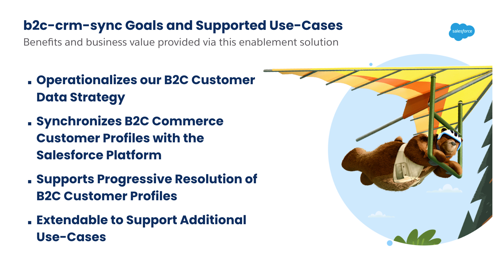
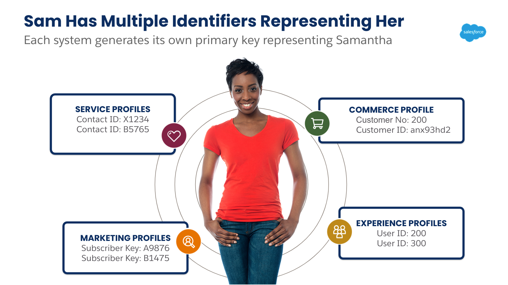
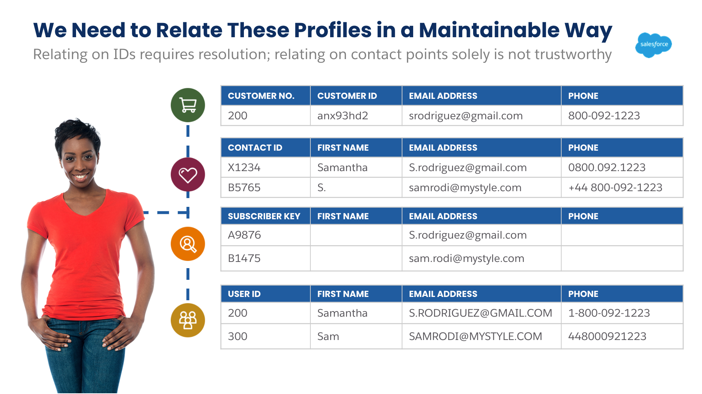
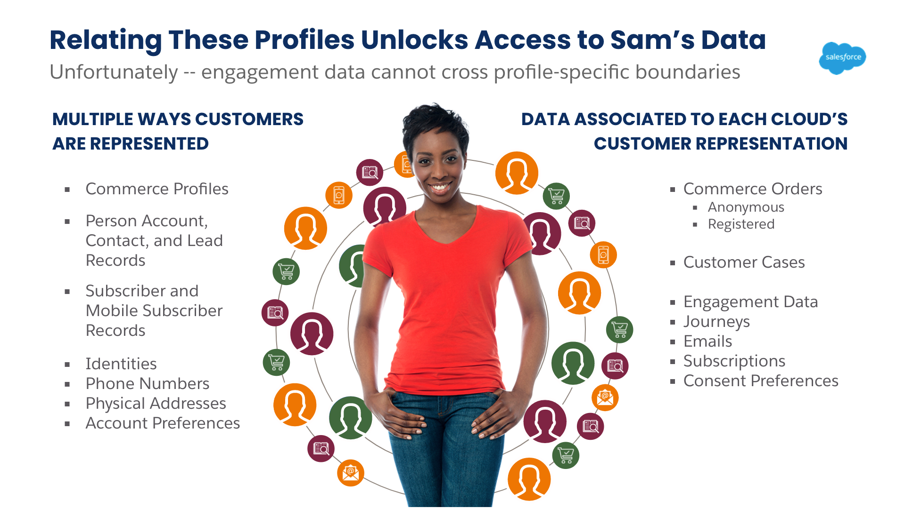
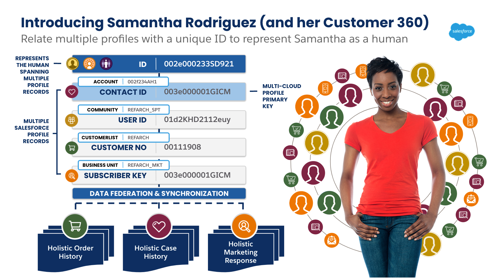
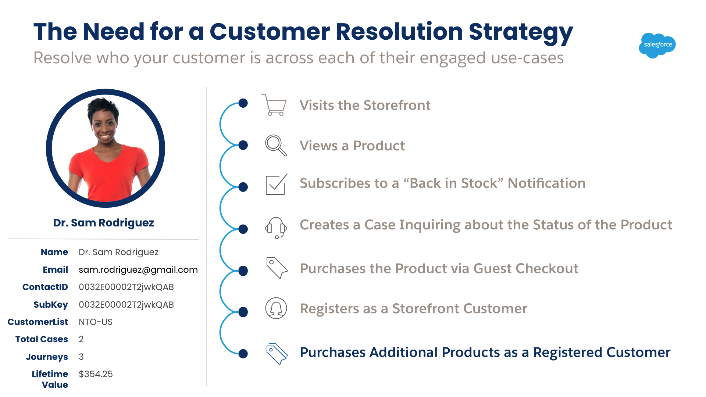

[b2c-crm-sync](https://sfb2csa.link/b2c-crm-sync) supports the following delivery goals that are realized by its integration approach, contemporary implementation leveraging the declarative capabilities of the Salesforce Platform, and supported use-cases.

	

### An Operationalized B2C Customer Data Strategy

In order to implement frictionless customer experiences that leverage B2C Commerce, Marketing Cloud, and the Salesforce Platform -- a strategy must be implemented to consistently identify customers within their digital journey.  [b2c-crm-sync](https://sfb2csa.link/b2c-crm-sync) enables this by anchoring to the Salesforce Platform ContactID as a multi-cloud customer profile primary key.

	
	
	
	
	

This strategy unlocks access to the customer engagement data that resides in Marketing Cloud, B2C Commerce, and the Salesforce Platform.  On-demand access to engagement data from any cloud that is providing the digital experience is what makes these customer experiences frictionless. [b2c-crm-sync](https://sfb2csa.link/b2c-crm-sync) implements this data strategy between B2C Commerce and the Salesforce Platform so that customers and partners can focus less time on implementing this plumbing -- and more time on generating business value through the creation of frictionless customer experiences.

### Supports Multiple B2C Commerce Instances and Storefronts

[b2c-crm-sync](https://sfb2csa.link/b2c-crm-sync) supports multiple B2C Commerce instances -- whether they be production, staging, development, or sandboxes.

- Configure instances through our Lightning App and leverage our automation to seed the CustomerLists and Sites associated to a given instance.  Verify your integration is working with quickActions provided and available on the Instance.
- Control at the Instance, CustomerList, and Site level which entities support integration with the Salesforce Platform.  Customer profiles are anchored to CustomerLists -- aligning Salesforce Contacts and Person Accounts with the same constraints used in B2C Commerce.

### Declarative Support for Accounts and Contacts or Person Accounts

[b2c-crm-sync](https://sfb2csa.link/b2c-crm-sync) supports both Accounts and Contacts or Person Accounts as customerModels used to represent B2C Commerce Customer Profiles.

- Business logic to manage synchronization and resolution is shared across both customerModels.  We've minimized the deltas between both models and separated them into two packages that are deployed automatically dependent on the chosen configuration.
- Our data strategy approach isolates all B2C Commerce customer profile updates to the Salesforce Contact -- independent of which customerModel is chosen.  This approach minimizes the impact on the Account object.
- No reference to PersonAccount fieldNames are made in our flows or Apex code.  This approach enables the shared business logic goals of the enablement solution.
- Configure which fields on a given Contact are mapped to B2C Commerce Customer Profile attributes through our field mapping tool.  For each mapping, control if synchronization is bi-directional, or should only be performed in one direction.

### Bi-Directional Synchronization of B2C Commerce Customer Profiles with the Salesforce Platform

[b2c-crm-sync](https://sfb2csa.link/b2c-crm-sync) enables the synchronization of B2C Commerce Customer Profiles with the Salesforce Platform as either Accounts and Contacts pairs or Person Accounts.  The synchronization is bi-directional:

- When a B2C Commerce customer profile is updated from an Account or Customer Profile page via the storefront -- those changes are automatically pushed to the corresponding Salesforce Platform Contact record.
- When a change is made to a Salesforce Platform Contact record representing a B2C Commerce Customer Profile, that change is automatically pushed to B2C Commerce.  This includes UI based changes as well as REST-API or DML changes.
- Define which integrated fields on a Contact can trigger changes that are pushed to B2C Commerce via our declarative fieldMapping tool.

Headless-triggered synchronization support is also included in [b2c-crm-sync](https://sfb2csa.link/b2c-crm-sync) via OCAPI Hooks.  All synchronization can be managed at the site-level via B2C Commerce Site Preferences which can be used to govern integration controls.  Similarly, integration with the Salesforce Platform can also be managed at the B2C Instance, CustomerList, and Site levels.

### Progressive Resolution of B2C Commerce Customer Profiles

Most customer experiences will be delivered without customers identifying themselves through a registered profile.  In order to consistently identify customers within their journey, a strategy must be implemented that supports progressive resolution.  In other words, we must be able to resolve who our customer is with the information they provide.

	

[b2c-crm-sync](https://sfb2csa.link/b2c-crm-sync) exposes a REST API that can be used to progressively resolve customers using the information available at key moments within their journey.

- It can resolve Contact records in the Salesforce Platform using email, lastname, and B2C Commerce identifiers (CustomerList, CustomerID, and CustomerNo).  It can also resolve Contact records using the Salesforce Platform ContactID.
- It can progressively update these Contact records as you collect more information about your customer.  These updates can be made via the exposed REST API -- and do not require a B2C Commerce Customer Profile be created.

In the sample journey above, we're able to create two cases and place Sam on three journeys -- and anchor all the engagement data in Marketing and Service Clouds to her ContactID.

At the end of her journey, we're able to then associate her B2C Commerce Customer Profile to the created Contact record.  This allows us to anchor her registered and guest-checkout orders to the same Contact record -- and gives us a real 360 view of Sam's digital engagement.  [b2c-crm-sync](https://sfb2csa.link/b2c-crm-sync) makes this possible.

### Extendable to Support Other Use-Cases

[b2c-crm-sync](https://sfb2csa.link/b2c-crm-sync) is designed with extensibility in mind -- and includes tools, patterns, and deployment capabilities designed to accelerate onboarding and implementation productivity.

- [b2c-crm-sync](https://sfb2csa.link/b2c-crm-sync) can be **deployed** to a B2C Commerce Sandbox and Salesforce scratchOrg in **under 15 minutes** through our [CLI deployment command library](https://github.com/sfb2csolutionarchitects/b2c-crm-sync/blob/4909a3f67b4998dbe895da0bae11198c17227451/package.json#L10).  Our [ReadMe.md](https://github.com/sfb2csolutionarchitects/b2c-crm-sync/blob/master/README.md) contains trustworthy guidance on how to set up b2c-crm-sync with consistency and velocity.
- All business logic used to manage enablement solution features and capabilities are authored using Salesforce Flow.  This includes our REST APIs, resolution and profile management objects, and UI administration features.
- Apex classes that power our Flows are written as invocable actions that can be leveraged in new flows and extended to support your requirements.
- The synchronization engine employed to synchronize B2C Commerce Customer Profiles with Salesforce Platform Contacts supports synchronization scenarios for any Salesforce object.  This engine can be used to synchronize other Salesforce objects with REST API responses.  These mappings can be configured to restrict which fields are read-only, can consume updates from B2C Commerce, and publish updates to B2C Commerce.
- Integration Security is managed via Connected Apps for each configured B2C Commerce storefront.  Named Credentials are used to govern access via each Connected App.
- Platform Events are used to trigger a Flow that either consume updates from B2C Commerce or publish updates to B2C Commerce. A single Platform Event is used to manage both scenarios.
- An SFRA plugin is used to trigger synchronization updates from a B2C Commerce storefront.  OCAPI hooks are used to trigger the same updates from B2C Commerce Shop APIs.  The patterns implemented can be extended to support other customer resolution and synchronization scenarios.
- Unit tests are included to validate B2C Commerce business logic, Salesforce Platform business logic, deployment tooling, and headless operation.

Collectively, these capabilities create a trustworthy foundation for customers and partners to innovate off of.  We include an example of this, by providing the **Assisted Shopping (Order on Behalf Of)** use-case.  This use-case allows Service Agents to securely shop and place orders on behalf of customers for configured B2C Commerce Storefronts.

### Tests for Every Occasion

[b2c-crm-sync](https://sfb2csa.link/b2c-crm-sync) includes a mature collection of tests that can be used to validate existing application behavior -- and extended as its capabilities are customized.  All tests can be executed via CLI commands.

- [B2C Commerce integration logic](https://github.com/sfb2csolutionarchitects/b2c-crm-sync/tree/master/test/b2c/int_b2ccrmsync/scripts) is accompanied by unit-tests to exercise its foundational capabilities.
- [b2c-crm-sync deployment commands](https://github.com/sfb2csolutionarchitects/b2c-crm-sync/tree/master/test/cli) come with unit-tests that validate command behavior for B2C Commerce deployments.
- [Apex classes](https://github.com/sfb2csolutionarchitects/b2c-crm-sync/tree/master/src/sfdc/base/main/default/classes) include enough test-coverage to support production deployment (at this time, we have 83% test coverage in place).
- [Over forty multi-cloud unit tests](https://github.com/sfb2csolutionarchitects/b2c-crm-sync/tree/master/test/_use-cases) are included to physically exercise the integration between B2C Commerce and the Salesforce Platform aligned with a customer's registration, authentication, profile updates, and progressive resolution use-cases.
- Tests can be incorporated into any existing CI / CD process to automate execution and assess the trustworthiness of any custom build.

All non-Apex tests are written using Mocha and [executable via the command-line](https://github.com/sfb2csolutionarchitects/b2c-crm-sync/blob/4909a3f67b4998dbe895da0bae11198c17227451/package.json#L47).  Now, maintaining test-coverage is a constant investment.  Like most projects, we have gaps we are always working to close.  The coverage we provide, though, enables customers and partners to quickly validate trustworthiness -- and can be extended to support your customizations.

> **More Detailed Use-Case Coverage Is Coming** We'll continue to expand on these use-cases and solution capabilities as we mature our documentation.  Hopefully, this provides you with enough information to be curious with our enablement solution.  We invite you to [start a discussion](https://github.com/sfb2csolutionarchitects/b2c-crm-sync/discussions/new) if you have any questions about solution features.

